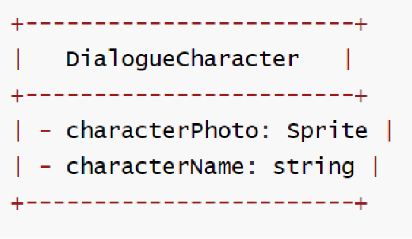
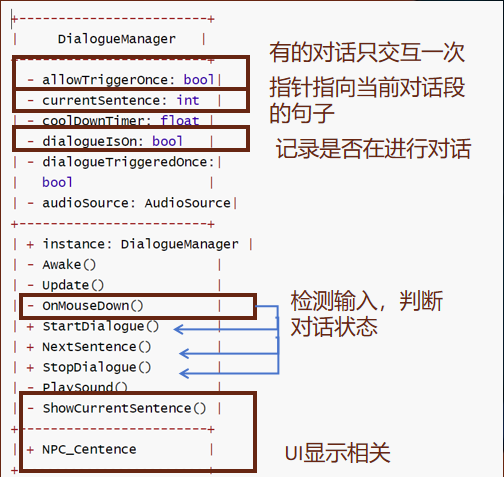
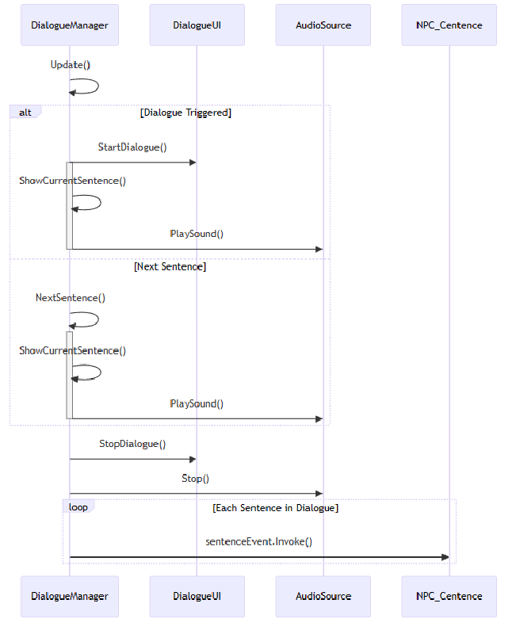
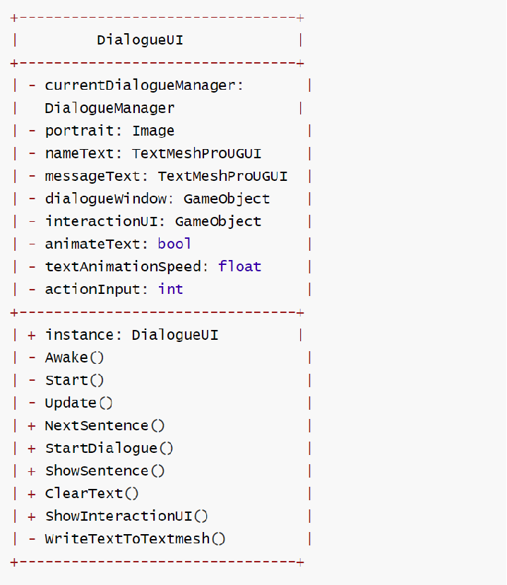
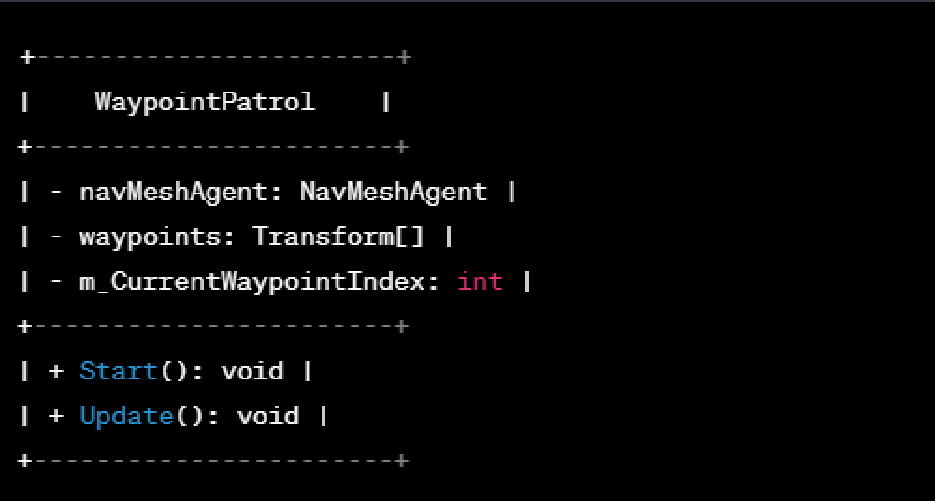
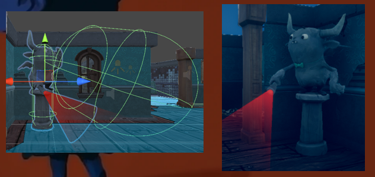
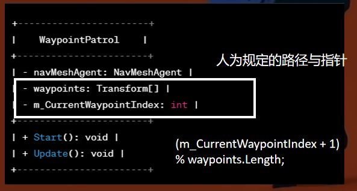
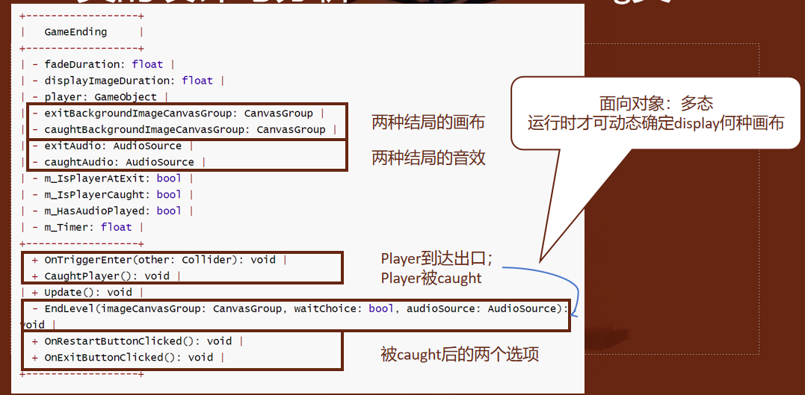

# UCAS Object Oriented Programming
> Final proj选题：游戏设计
>
> 游戏的repo（诚邀一起开发🤧）：https://github.com/Cassie-Lim/Beyond-the-Life
>
> 在代码基本完善的情况下，只需要搭建新的场景、编写故事线...想学做游戏的话是个很好的上手机会！

## 1. 游戏整体介绍

- 故事线：当你一觉醒来，却被告知你已经嗝屁了……

  每个关卡是一个关于死亡的切入点：

  - Level 0：Intro关卡 （Done）
  - Level 1：宗教与死亡（Doing）
  - Level 2：生命长短
  - Level 3：生命的自我剥夺
  - Level 4：生命与意识形态
  - Level 5：存在与人生意义

- 玩法：角色与环境的互动（含与NPC互动、与物体互动、躲避敌人...）

## 2. 类的设计与分析

### 2.1 GameManager

**类描述**：

`GameManager` 是游戏架构中的核心组件，承担着控制游戏各个方面的职责。此类负责管理游戏的总体状态，包括追踪玩家和非玩家角色（NPCs），提供存储和恢复游戏进展的机制，即 `Gamestate`，其中 保存了玩家和NPC的位置和方向信息。

**GameManager 管理的关键对象**：

- **玩家（Players）**：`GameManager` 维护一个玩家列表（用户与所有NPC），这些玩家通过 `GameObject` 实例表示。这允许游戏环境中对玩家对象进行高效跟踪和操作。
- **菜单和关卡（Menu and Levels）**：`GameManager` 还管理着不同菜单和关卡之间的转换，确保玩家在游戏中的流畅体验和导航。

**核心操作**：

- **SaveGamestate() 和 LoadGamestate()**：`GameManager` 实现了保存当前游戏状态的关键功能，这包括玩家和NPC的位置与朝向。保存机制使用Unity内置的`Playeref`将这些数据序列化到持久存储格式中。相应地，`LoadGamestate()` 操作则恢复保存的状态，将存储的数据反序列化回游戏中，使玩家能够从上次离开的地方继续游戏。

- **StartNewGame()**：此方法初始化开始新游戏会话所需的条件，重置游戏状态并为新的开始准备环境。它确保所有游戏元素都设置为默认状态。
- **事件处理（OnSceneLoaded, OnEnable, OnDisable）**：`GameManager` 对游戏生命周期中的特定事件做出反应。由于本游戏设计中加载新的关卡或场景时，都会播放该关卡对应的概念视频，故使用`OnSceneLoaded()` 设置音频播放管理的游戏组件。`OnEnable()` 和 `OnDisable()` 分别处理 `GameManager` 的激活和停用，允许进行设置和拆除操作。

**单例模式**：

- `Instance` 属性表明 `GameManager` 是使用单例模式实现的，确保整个游戏中只有一个此类的实例存在。这种设计模式提供了一个全局可访问的 `GameManager` 实例，这对于协调游戏不同组件和系统之间的动作和信息流转至关重要。

**生命周期方法**：

- **Awake() 和 Start()**：作为 Unity 引擎脚本生命周期的一部分，`Awake()` 在脚本实例被加载时调用，`Start()` 在任何 `Update` 方法之前调用。这些用于在游戏开始前进行 `GameManager` 所需的初始化，`Awake()`使用单例模式声明了 `GameManager` 的instance，`Start()` 则遍历当前环境的所有物体，找到含有人工标记的`Player` tag的物体并将之置于`players`数组中。

**UML类图：**

以下是在GameManager控制下实现场景切换、视频播放的示例：

https://github.com/Cassie-Lim/UCAS-Object-Oriented-Programming/assets/98252468/72b807a6-e1cf-43a1-86b5-711ababee9d5

### 2.2 Level

**类描述**：

`Level` 类代表了游戏中的一个关卡，相当于 Unity 中的一个场景（Scene）。每个 `Level` 实例封装了构成单个关卡所需的所有元素和行为。它负责管理关卡特有的资源和对象，如导航网格（NavMesh）、全局后处理设置、音频、角色和摄像机等。此外，`Level` 类提供了关卡之间共享和差异化特征的管理能力，详见后续描述。

**核心属性**：

- **NavMesh Surface**：管理关卡的导航网格，用于支持AI角色的路径规划和寻路。
- **GlobalPost**：定义了关卡的全局后处理效果，如光照、阴影、颜色校正等，用于调整和优化关卡的视觉效果。
- **Audio**：包含关

卡内的音频组件，负责播放背景音乐和环境声效，以及角色和互动事件的声音。

- **Characters**：存放所有角色对象，包括玩家控制的角色和非玩家角色（NPCs），以及它们的行为逻辑和状态信息。
- **Cameras**：包含一组摄像机对象，控制玩家视角和关卡内的其他视觉呈现。

**功能方法**：

- **LoadLevel()**：加载关卡资源，初始化关卡内的所有对象和设置。
- **UnloadLevel()**：释放关卡资源，清理内存中的关卡数据，为加载新关卡做准备。
- **UpdateLevelState()**：更新关卡状态，包括玩家进度、角色状态和环境效果。
- **SaveLevelState()**：保存当前关卡状态，以便玩家下次可以从同一状态开始。
- **RestartLevel()**：重置关卡到初始状态，为玩家重新挑战关卡提供支持。

**共享与差异化特征管理**：

`Level` 类通过继承和组合模式实现关卡间共享元素和差异化元素的管理。共享元素例如`LevelUI`（包含开场视频的画布、对话UI、暂停退出键UI等），可能在多个关卡中保持一致；而差异化元素，如特定关卡的布局、敌人配置和任务，每个 `Level` 实例中都有自己的定义。

以下是Level0的导航网格和游戏画面示意：

### 2.3 Dialogue系统

该系统由三个重要的类组成：对话角色、对话管理器、对话UI，其共同完成了游戏对话逻辑的实现。

#### 2.3.1 Dialogue Character

**类描述**：

`DialogueCharacter` 类代表游戏中参与对话的角色。这个类封装了角色在对话系统中的关键信息，包括角色的照片和名称。

**属性**：

- **characterPhoto**：类型为 `Sprite`，存储角色的图像资源，用于在对话框中展示角色形象。
- **characterName**：类型为 `string`，存储角色的名称，在对话中显示以标识说话的角色。

**UML类图：**

以主角为例：

#### 2.3.2 Dialogue Manager

**类描述**：

`DialogueManager` 类是游戏中负责处理对话逻辑的核心管理器。它控制对话的流程，包括触发对话，展示对话内容，以及管理对话中的对应音频播放（本游戏中的配音由AI完成）。该管理器允许对话在游戏中按预定顺序展开，并能够在对话结束后执行必要的清理工作。

**属性**：

- **allowTriggerOnce**：布尔类型，决定对话是否只触发一次。（目前实现逻辑：与NPC的对话只进行一次，而和环境物体的互动允许多次点击）
- **currentSentence**：整型，记录当前显示的对话句子索引。
- **coolDownTimer**：浮点数，用于管理对话触发后的冷却时间。
- **dialogueIsOn**：布尔类型，表示当前是否有对话正在进行。
- **dialogueTriggeredOnce**：布尔类型，记录对话是否已经至少触发过一次。
- **audioSource**：`AudioSource` 类型，用于管理对话中的音频播放。

**方法**：

- **instance**：`DialogueManager` 类型的静态实例，用于实现单例模式，保证全局只有一个对话管理器实例。
- **Awake()**：在脚本加载时调用，进行初始化设置。

- **Update()**：在每帧更新时调用，可能用于监控对话状态和处理冷却计时。
- **OnMouseDown()**：当鼠标点击时触发，可能用于开始对话或者触发下一句对话。
- **StartDialogue()**：开始一段对话，初始化对话流程。
- **NextSentence()**：显示下一句对话，控制对话内容的顺序展示。
- **StopDialogue()**：停止对话，执行清理和结束对话所需的操作。
- **PlaySound()**（命名应为 `PlaySound`）：播放对话相关的音频。
- **ShowCurrentSentence()**：展示当前的对话句子。

**内部类**：

类图中还有一个内部类 `NPC_Sentence`，其中包含了一个”规范“的句子应包含的信息：说该句话的角色、该句话的内容、对应的音频等。

**UML类图：**

**顺序图：**

**单例模式**：

`DialogueManager` 的设计使用了单例模式，确保整个游戏中只存在一个对话管理器的实例，这个实例可以从任何地方被访问和控制，以便于统一管理游戏中的对话流程。

**使用场景**：

- 当玩家与游戏世界中的NPC交互时，可以通过 `DialogueManager` 触发对话。
- 在对话过程中，`DialogueManager` 负责逐句递送给`DialogueUI`，其负责展示对话内容，并在适当的时候播放对应的音频，增强游戏的沉浸感。
- 对话完成后，`DialogueManager` 会清理已展示的对话并准备下一段对话，或者结束对话功能，允许玩家继续游戏。

#### 2.3.3 Dialogue UI

**类描述**：

`DialogueUI` 类负责游戏中对话界面的用户交互部分。它处理与玩家展示对话文本、角色名称、角色肖像以及任何额外的交互界面相关的所有UI元素。该类通过控制文本动画和UI窗口的显示与隐藏，提供了一个直观且动态的对话体验。

**属性**：

- **currentDialogueManager**：类型为 `DialogueManager`，用于引用当前对话管理器实例，以协调对话流程。
- **portrait**：类型为 `Image`，用于展示当前说话角色的肖像。
- **nameText**：类型为 `TextMeshProUGUI`，用于显示当前说话角色的名字。
- **messageText**：类型为 `TextMeshProUGUI`，用于显示对话消息文本。
- **dialoguewindow**：类型为 `GameObject`，表示对话窗口的UI元素。
- **interactionUI**：类型为 `GameObject`，表示与对话相关的其他交互UI组件。
- **animateText**：布尔类型，控制是否以动画形式显示文本。（即逐字出现，而非整行显示）
- **textAnimationSpeed**：浮点数，表示文本动画的速度。
- **actionInput**：整型，用于处理用户输入。

**方法**：

- **instance**：`DialogueUI` 类型的静态实例，用于实现单例模式，确保全局只有一个对话UI管理器实例。

- **Awake()**：在脚本实例化时调用，进行初始化设置。
- **Update()**：在每帧更新时调用，用于监控用户输入或者更新UI动画。
- **StartDialogue()**：启动对话流程，打开对话界面，并准备显示第一句话。
- **NextSentence()**：展示对话中的下一句话。
- **ShowSentence()**：用于在 UI 中显示当前的对话句子，配合 `animateText` 和 `textAnimationSpeed` 来控制文本显示的方式。

- **ClearText()**：清除对话文本框中的内容，为下一句话或对话的结束做准备。
- **ShowInteractionUI()**：展示或更新与对话相关的交互UI元素，如提示玩家可以进行下一步操作的按钮或图标。
- **writeTextToTextmesh()**（命名应为 `WriteTextToTextmesh`）：私有方法，负责将文本内容写入 TextMesh 组件，如果 `animateText` 为真，则会按 `textAnimationSpeed` 指定的速度逐字显示文本。

**UML类图**：

**使用场景**：

- 在角色对话交互时，`DialogueUI` 类被用来管理显示对话内容的 UI 元素，包括角色的头像、名字以及对话文本。
- 它响应游戏逻辑的触发，如玩家与 NPC 交互时，使用 `StartDialogue` 方法来初始化并开始一个新的对话序列。
- 在对话进行中，`NextSentence` 方法用于逐句推进对话内容的展示，而 `ClearText` 方法则在对话结束时清理文本框。

以下是对话系统工作的示意视频：

https://github.com/Cassie-Lim/UCAS-Object-Oriented-Programming/assets/98252468/7afa6063-2159-42ad-bb66-7444b74cf34e

### 2.4 NPC类

玩家需要保证不被敌人NPC发现，敌人NPC分为固定的和可移动的，下面将展开介绍其设计实现。

- 所有NPC都需要实现一个”检测“人类玩家的功能，其实现由`Observer`类完成；
- 对于可移动NPC，我们还需使用`WaypointPatrol`规定其可以行走的范围，避免出现NPC随机游走而使得玩家基本无法获胜的情况；

#### 2.4.1 Observer

**类描述**：

`Observer` 类是一个监测组件，用于检测人类玩家是否进入某个区域。它与游戏中的触发器联动，人为定义一个胶囊碰撞体作为敌人的视野范围。当玩家进入或离开指定区域时（即发生”碰撞“），`Observer` 类会响应相应的事件，并可能触发游戏结束逻辑。

**属性**：

- **player**: `Transform` 类型，用于引用和跟踪玩家的位置。
- **gameEnding**: `GameEnding` 类型，与游戏结束逻辑关联，用于处理玩家被发现后的游戏结束条件。
- **m_IsPlayerInRange**: `bool` 类型，用于标记玩家是否在监测区域内。

**方法**：

- **OnTriggerEnter(other: Collider)**: 当其他 `Collider` 进入触发器时调用。如果检测到的是玩家，将会更新 `m_IsPlayerInRange` 为 `true`，并执行相应的游戏逻辑。
- **OnTriggerExit(other: Collider)**: 当其他 `Collider` 离开触发器时调用。将 `m_IsPlayerInRange` 更新为 `false`，并执行相应的游戏逻辑。
- **Update()**: 在每帧调用以持续检测玩家状态，可能会检查玩家是否仍在监测区域内，并更新游戏状态。

**UML类图**：

实现了Observer类后，我们就可以实现固定位置的NPC：

左图绿色胶囊是开发者界面可见的规定的视野范围，右图是游戏运行过程的动画化NPC角色。

#### 2.4.2 WaypointPatrol

**类描述**：

`WaypointPatrol` 类用于控制NPC在一组指定的路径点（Waypoints）之间巡逻。这个类利用 Unity 的导航网格系统（NavMesh）来指导NPC沿着预定的路径移动，从而实

现复杂的路径跟随和巡逻行为。NPC将会按照路径点数组中的顺序，从一个点移动到下一个点。

**属性**：

- **navMeshAgent**: `NavMeshAgent` 类型，负责处理NPC在导航网格上的移动。
- **waypoints**: `Transform[]` 类型，表示NPC巡逻的一系列路径点。
- **m_CurrentWaypointIndex**: `int` 类型，记录当前目标路径点的索引。

**方法**：

- **Start()**: 初始化方法，在组件激活时调用。用于设置初始的路径点。
- **Update()**: 在每帧调用，负责监控和更新NPC的移动，当NPC到达当前目标路径点时，更新索引以指向下一个路径点。（注意这里使用了循环指针`(m_CurrentWaypointIndex + 1) % waypoints.Length`，在定义路径的时候形成闭环）

NPC在固定点间往复运动示意：

https://github.com/Cassie-Lim/UCAS-Object-Oriented-Programming/assets/98252468/b31d6a36-bbdd-4f1c-9daf-27cf8f5da0bc

### 2.5 GameEnding

**类描述**：

`GameEnding` 类负责处理游戏的结局逻辑，包括玩家被抓和成功逃脱两种情况。该类通过监测玩家的状态和触发器事件来决定何时触发游戏结束的画面和音频效果，并管理结束画面的淡入淡出效果以及展示的持续时间。

**属性**：

- **fadeDuration**: `float` 类型，定义画面淡入淡出效果的持续时间。
- **displayImageDuration**: `float` 类型，定义游戏结束画面显示的时间长度。
- **player**: `GameObject` 类型，指向游戏中的玩家对象。
- **exitBackgroundImageCanvasGroup**: `CanvasGroup` 类型，用于管理成功逃脱时显示的画布组合。

- **caughtBackgroundImageCanvasGroup**: `CanvasGroup` 类型，用于管理被抓时显示的画布组合。
- **exitAudio**: `AudioSource` 类型，用于播放玩家成功逃脱时的音频。
- **caughtAudio**: `AudioSource` 类型，用于播放玩家被抓时的音频。
- **m_IsPlayerAtExit**: `bool` 类型，标记玩家是否到达了逃脱出口。
- **m_IsPlayerCaught**: `bool` 类型，标记玩家是否被抓。
- **m_HasAudioPlayed**: `bool` 类型，用于确保结束音频只播放一次。
- **m_Timer**: `float` 类型，用作计时器，用于跟踪结束画面显示的时间。

**方法**：

- **OnTriggerEnter(other: Collider)**: 当玩家进入触发器区域时调用，可能用于判断玩家是否到达了逃脱点或者被敌方捕获。
- **CaughtPlayer()**: 处理玩家被抓的逻辑，激活被抓的结束画面和音效。
- **Update()**: 在每帧调用，可能用于监控游戏结束逻辑的状态，如淡入淡出效果、结束画面的展示等。
- **EndLevel(CanvasGroup imageCanvasGroup, bool waitChoice, AudioSource audioSource)**: 结束当前关卡，并根据玩家是否被抓或者逃脱显示相应的画面和播放音效。
- **OnRestartButtonClicked()**: 当玩家点击重启按钮时调用，用于重置游戏状态并重新开始。
- **OnExitButtonClicked()**: 当玩家点击退出按钮时调用，用于退出游戏或返回主菜单。

**UML类图**：

## 3. 高级设计思路分析

[TODO]

## 4. TODO LIST

### 4.1 游戏多样性增强

- **实现多结局系统**：
  - 设计不同的游戏走向，确保用户的选择能够影响游戏结局。
- **扩展游戏元素：**
  - 增加物品栏功能，让玩家可以收集和使用游戏中的物品。
- **融入解谜元素：**
  - 加入解谜逻辑，提升游戏的互动性和挑战性。

### 4.2 用户体验优化

- **操作提示增强：**
  - 在游戏开始时或关键时刻提供操作指南，例如如何避开特定的NPC。
- **交互性提示：**
  - 对可交互的游戏对象增加鼠标悬停（Hover）事件提示，让玩家能够轻松识别可以互动的元素。

### 4.3 游戏存档系统改进

- **存档数据管理：**
  - 替换现有的使用 Unity 内置 `PlayerPrefs` 的存档系统，采用 JSON 格式固化存档数据，以解决当前存档中存在的Bug问题。

