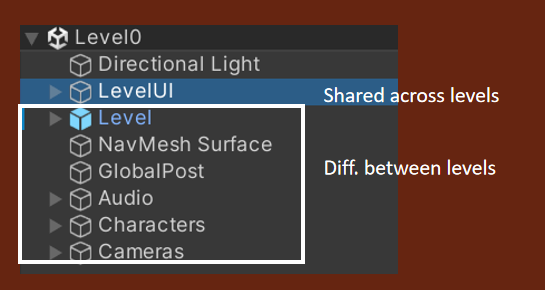

# UCAS Object Oriented Programming
> Final proj选题：游戏设计

## 1. 游戏整体介绍

- 故事线：当你一觉醒来，却被告知你已经嗝屁了……

  每个关卡是一个关于死亡的切入点：

  - Level 0：Intro关卡 （Done）
  - Level 1：宗教与死亡（Doing）
  - Level 2：生命长短
  - Level 3：生命的自我剥夺
  - Level 4：生命与意识形态
  - Level 5：存在与人生意义

- 玩法：角色与环境的互动（含与NPC互动、与物体互动、躲避敌人...）

## 2. 类的设计与分析

### 2.1 GameManager

**类描述**：

`GameManager` 是游戏架构中的核心组件，承担着控制游戏各个方面的职责。此类负责管理游戏的总体状态，包括追踪玩家和非玩家角色（NPCs），提供存储和恢复游戏进展的机制，即 `Gamestate`，其中 保存了玩家和NPC的位置和方向信息。

**GameManager 管理的关键对象**：

- **玩家（Players）**：`GameManager` 维护一个玩家列表（用户与所有NPC），这些玩家通过 `GameObject` 实例表示。这允许游戏环境中对玩家对象进行高效跟踪和操作。
- **菜单和关卡（Menu and Levels）**：`GameManager` 还管理着不同菜单和关卡之间的转换，确保玩家在游戏中的流畅体验和导航。

**核心操作**：

- **SaveGamestate() 和 LoadGamestate()**：`GameManager` 实现了保存当前游戏状态的关键功能，这包括玩家和NPC的位置与朝向。保存机制使用Unity内置的`Playeref`将这些数据序列化到持久存储格式中。相应地，`LoadGamestate()` 操作则恢复保存的状态，将存储的数据反序列化回游戏中，使玩家能够从上次离开的地方继续游戏。

- **StartNewGame()**：此方法初始化开始新游戏会话所需的条件，重置游戏状态并为新的开始准备环境。它确保所有游戏元素都设置为默认状态。
- **事件处理（OnSceneLoaded, OnEnable, OnDisable）**：`GameManager` 对游戏生命周期中的特定事件做出反应。由于本游戏设计中加载新的关卡或场景时，都会播放该关卡对应的概念视频，故使用`OnSceneLoaded()` 设置音频播放管理的游戏组件。`OnEnable()` 和 `OnDisable()` 分别处理 `GameManager` 的激活和停用，允许进行设置和拆除操作。

**单例模式**：

- `Instance` 属性表明 `GameManager` 是使用单例模式实现的，确保整个游戏中只有一个此类的实例存在。这种设计模式提供了一个全局可访问的 `GameManager` 实例，这对于协调游戏不同组件和系统之间的动作和信息流转至关重要。

**生命周期方法**：

- **Awake() 和 Start()**：作为 Unity 引擎脚本生命周期的一部分，`Awake()` 在脚本实例被加载时调用，`Start()` 在任何 `Update` 方法之前调用。这些用于在游戏开始前进行 `GameManager` 所需的初始化，`Awake()`使用单例模式声明了 `GameManager` 的instance，`Start()` 则遍历当前环境的所有物体，找到含有人工标记的`Player` tag的物体并将之置于`players`数组中。

**UML类图：**

以下是在GameManager控制下实现场景切换、视频播放的示例：

### 2.2 Level

**类描述**：

`Level` 类代表了游戏中的一个关卡，相当于 Unity 中的一个场景（Scene）。每个 `Level` 实例封装了构成单个关卡所需的所有元素和行为。它负责管理关卡特有的资源和对象，如导航网格（NavMesh）、全局后处理设置、音频、角色和摄像机等。此外，`Level` 类提供了关卡之间共享和差异化特征的管理能力，详见后续描述。

**核心属性**：

- **NavMesh Surface**：管理关卡的导航网格，用于支持AI角色的路径规划和寻路。
- **GlobalPost**：定义了关卡的全局后处理效果，如光照、阴影、颜色校正等，用于调整和优化关卡的视觉效果。
- **Audio**：包含关

卡内的音频组件，负责播放背景音乐和环境声效，以及角色和互动事件的声音。

- **Characters**：存放所有角色对象，包括玩家控制的角色和非玩家角色（NPCs），以及它们的行为逻辑和状态信息。
- **Cameras**：包含一组摄像机对象，控制玩家视角和关卡内的其他视觉呈现。

**功能方法**：

- **LoadLevel()**：加载关卡资源，初始化关卡内的所有对象和设置。
- **UnloadLevel()**：释放关卡资源，清理内存中的关卡数据，为加载新关卡做准备。
- **UpdateLevelState()**：更新关卡状态，包括玩家进度、角色状态和环境效果。
- **SaveLevelState()**：保存当前关卡状态，以便玩家下次可以从同一状态开始。
- **RestartLevel()**：重置关卡到初始状态，为玩家重新挑战关卡提供支持。

**共享与差异化特征管理**：

`Level` 类通过继承和组合模式实现关卡间共享元素和差异化元素的管理。共享元素例如`LevelUI`（包含开场视频的画布、对话UI、暂停退出键UI等），可能在多个关卡中保持一致；而差异化元素，如特定关卡的布局、敌人配置和任务，每个 `Level` 实例中都有自己的定义。

以下是Level0的导航网格和游戏画面示意：

### 2.3 Dialogue系统

该系统由三个重要的类组成：对话角色、对话管理器、对话UI。

#### 2.3.1 Dialogue Character

**类描述**：

`DialogueCharacter` 类代表游戏中参与对话的角色。这个类封装了角色在对话系统中的关键信息，包括角色的照片和名称。

**属性**：

- **characterPhoto**：类型为 `Sprite`，存储角色的图像资源，用于在对话框中展示角色形象。
- **characterName**：类型为 `string`，存储角色的名称，在对话中显示以标识说话的角色。

以主角为例：

#### 2.3.2 Dialogue Manager

**类描述**：

`DialogueManager` 类是游戏中负责处理对话逻辑的核心管理器。它控制对话的流程，包括触发对话，展示对话内容，以及管理对话中的对应音频播放（本游戏中的配音由AI完成）。该管理器允许对话在游戏中按预定顺序展开，并能够在对话结束后执行必要的清理工作。

**属性**：

- **allowTriggerOnce**：布尔类型，决定对话是否只触发一次。（目前实现逻辑：与NPC的对话只进行一次，而和环境物体的互动允许多次点击）
- **currentSentence**：整型，记录当前显示的对话句子索引。
- **coolDownTimer**：浮点数，用于管理对话触发后的冷却时间。
- **dialogueIsOn**：布尔类型，表示当前是否有对话正在进行。
- **dialogueTriggeredOnce**：布尔类型，记录对话是否已经至少触发过一次。
- **audioSource**：`AudioSource` 类型，用于管理对话中的音频播放。

**方法**：

- **instance**：`DialogueManager` 类型的静态实例，用于实现单例模式，保证全局只有一个对话管理器实例。
- **Awake()**：在脚本加载时调用，进行初始化设置。

- **Update()**：在每帧更新时调用，可能用于监控对话状态和处理冷却计时。
- **OnMouseDown()**：当鼠标点击时触发，可能用于开始对话或者触发下一句对话。
- **StartDialogue()**：开始一段对话，初始化对话流程。
- **NextSentence()**：显示下一句对话，控制对话内容的顺序展示。
- **StopDialogue()**：停止对话，执行清理和结束对话所需的操作。
- **PlaySound()**（命名应为 `PlaySound`）：播放对话相关的音频。
- **ShowCurrentSentence()**：展示当前的对话句子。

**内部类**：

类图中还有一个内部类 `NPC_Sentence`，其中包含了一个”规范“的句子应包含的信息：说该句话的角色、该句话的内容、对应的音频等。

**单例模式**：

`DialogueManager` 的设计使用了单例模式，确保整个游戏中只存在一个对话管理器的实例，这个实例可以从任何地方被访问和控制，以便于统

一管理游戏中的对话流程。

**使用场景**：

- 当玩家与游戏世界中的NPC交互时，可以通过 `DialogueManager` 触发对话。
- 在对话过程中，`DialogueManager` 负责逐句递送给`DialogueUI`，其负责展示对话内容，并在适当的时候播放对应的音频，增强游戏的沉浸感。
- 对话完成后，`DialogueManager` 会清理已展示的对话并准备下一段对话，或者结束对话功能，允许玩家继续游戏。

#### 2.3.3 Dialogue UI

### 2.4 NPC类

#### 2.4.1 固定位置NPC

#### 2.4.2 可移动NPC

