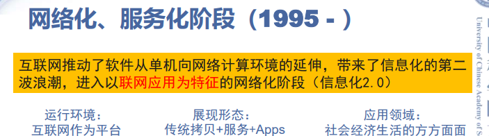
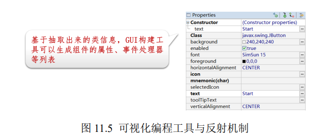

# 面向对象

[TOC]

## 第一课：概述&导言

1. 软件交互空间与对象的演变
   机器空间→进程空间→网络空间→物理与社会空间
2. 软件(系统)是一种对主客观世界进行信息描述、映射，并驱动和协调人、机、物等资源运行的支撑系统
3. 通识教育：高度抽象性、概括性
   计算思维：抽象&分解-->关注的分离、模块化
4. 软件发展与解耦
   
5. 面向对象思想相关人物：
   - 基础构想：Ole -Johan Dahl （奥利-约翰·达尔）、Kristen Nygaard（克利斯登·奈加特），2001 年ACM图灵奖
   - 面向对象语言：Alan Kay（艾伦·凯），2003 年ACM图灵奖

## 第二课：对象技术导论(一)

### 2.1 软件系统复杂性

1. 为何复杂？
   - 问题域的复杂性
     - 领域自身的复杂性（卫星导航系统、交通指挥系统、气象监测系统、电子商务系统…） 
     - 功能要求、非功能要求（性能、安全、可靠性、可用性…） 
     - 软件系统用户和开发者之间的沟通问题 
     - 需求经常变更（软件改变了用户“问题域”的行为规则，进而带来更好的需求理解和 表述）
   - 管理开发过程的困难性 
     - 代码管理问题（几十年前，数千行的汇编程序；现在，高级语言编写的系统代码 规模达到百万、千万行）
     - 成百上千的独立模块、第三方程序包…
     - 开发团队的沟通、协作问题，如何维持设计的一致性和完整性？
   - 软件中随处可能出现的灵活性（“软件定义一切”的诱惑）
     - 软件开发人员可以表达任何形式的抽 象，这种灵活性“诱使”开发人员打造几乎所有的初级构建模块-->劳动密集型产业
   -  描述离散系统行为的问题：系统外部的输入、子系统之间的数据交互...
2. 系统越复杂，就越容易全面崩溃实例：
   

3. 复杂系统5个属性

   - 层次结构
   - 相对基础
   - 关注点分离（分而治之）
     - 层次系统的可分解性，意味着子系统内部的联系通常比子系统之间的联系更强， 子系统内部的高频行为与子系统之间的外部低频行为实现了分离 
     - 让我们能够以相对隔离的方式来研究每个部分，也让子系统的行为对其他子系统 以及系统整体的影响有限
   - 共同模式
     - 复杂系统往往是以一种经济的表达方式来实现的，即层次结构通常只是由少数 不同类型的子系统，按照不同的组合和安排方式构成
     -  这种共同的模式，其本质是对组件、子系统的复用，例如，细胞、脉管系统， 在植物和动物系统中都存在
   - 稳定的中间形式（“螺旋”演变）（由稳定的“简单”到“稳定”的复杂）
     - 从头设计的复杂系统往往不能工作，打 补丁的方式也难以有效，必须从能工作的 简单系统开始，持续演进… 
     - 随着系统的演变，简单系统变得复杂， 进一步又变为基础组件，在这些基础组件 上构建更复杂的系统

### 2.2 Java语言基础

1. Java特点：
      - 简单易学： 去除C++中不容易理解的部分（如指针） 不需要维护内存分配 
      - 面向对象： 有利于程序的开发、复用和维护 
      - 平台无关性： Java编译器生成与体系结构无关的字节码，Java解释器得到字节码后，把它转换为 目标平台的机器语言，使之能够在不同的平台运行 
      - 健壮性： 垃圾回收、异常机制
        

2. Java程序开发、运行的基本过程 

      - 利用编辑工具编写Java源程序 

        > 源代码文件：类名.java 

      - 利用编译器将源程序编译成字节码 

        > 字节码文件：类名.class 

      - 利用Java虚拟机运行 

        > 载入、代码校验、执行

        

3. Java程序代码分析：

      - 类名： 每个Java程序至少有一个类，类名首字母大写

      - 主方法 ：主方法不是类的必要组成，但如果要运行一个类，则该类需要包含一个主方法

        ```java
        // This program prints Welcome to Java! 
        public class Welcome {
        public static void main(String[] args) { 
        System.out.println("Welcome to Java!");
        }
        }
        ```

      - 语句 ：一条语句表示一个或一组行为，语句以“；”结束

      - 保留字 ：保留字，也称关键字，是对编译器有特定含义的单词

        > 例如：当编译器看到单词class，就会明白class后面的单词就是这个类的，如`public static void ` `public class`

      - 块 ：大括号，类块/方法块

      - 注释：

        - 行注释 行注释是在单行上最前面加两个斜杠（//）表示注释某行 
        - 段注释 段注释是在一行或多行中用 /*与 */ 括住某一段表示注释某段 
        - javadoc注释 javadoc注释是以 /** 开始，以 */结束

4. 基本数据类型
      

5. 数值运算符
      

6. 变量、常量的声明与赋值
      

7. 从控制台读取输入：Scanner

      ```java
      import java.util.Scanner;  // Import the Scanner class
      
      class Main {
        public static void main(String[] args) {
          Scanner myObj = new Scanner(System.in);  // Create a Scanner object
          System.out.println("Enter username");
      
          String userName = myObj.nextLine();  // Read user input
          System.out.println("Username is: " + userName);  // Output user input
        }
      }
      ```

      | Method          | Description                           |
      | :-------------- | :------------------------------------ |
      | `nextBoolean()` | Reads a `boolean` value from the user |
      | `nextByte()`    | Reads a `byte` value from the user    |
      | `nextDouble()`  | Reads a `double` value from the user  |
      | `nextFloat()`   | Reads a `float` value from the user   |
      | `nextInt()`     | Reads a `int` value from the user     |
      | `nextLine()`    | Reads a `String` value from the user  |
      | `nextLong()`    | Reads a `long` value from the user    |
      | `nextShort()`   | Reads a `short` value from the user   |

8. 数值类型转换

   - 类型拓宽 将小范围类型的变量转换为大范围类型的变量 

     隐式转换，程序可自动执行 

     > double d = 3; （类型拓宽）

   - 类型缩窄 将大范围类型的变量转换为小范围类型的变量 

     显示转换 

     > int i = (int)3.0; （类型缩窄） 
     >
     > int i = (int)3.9; （截掉小数部分）

9. 流程控制——选择

   - Boolean值，true（真）或false（假）

   - if (else)

   - switch

     ```java
     switch (表达式或变量) {
     case 条件值1：
      语句块1；
      break；
     case 条件值2：
      语句块2；
      break；
     …
     default：
      语句块N；
      break；
     }
     ```

10. 流程控制——循环

    - while
    - do while
    - for
    - 跳转语句——break和continue

## 第三课：对象技术导论(二)

### 3.1 有组织的复杂系统

1. 复杂系统层次结构

   - 视角1——**对象化**(组件化，part of)

   - 视角2——**类型化**(分类化，is a)
     

     “对象”结构的每个对象都代表了某个类型的一个具体实例 “类型”结构将共性组件进行抽象，避免了系统冗余

2. 操作系统与计算机的协同发展
   早期操作系统的出现开启了通用计算机及其广泛应用的时代， 从大型主机操作系统，到个人计算机操作系统，再到移动终端操作系统， 每一次“新一代操作系统”的出现都推动了计算机产业的跨越式发展
   

3. 显著增加软件系统的复杂性 vs 人类有限的能力

   - 专业分工——需求分析师、系统设计师、程序员、测试人员…
   - 指导思想——结构化、面向对象、敏捷开发、测试驱动、持续集成、开源…
   - 语言工具——建模语言、编程语言、开发环境（工具）、源码管理工具、测试工具…

   -->分而治之

   - “算法”结构？ ——面向过程的程序设计思想 
   - “对象”结构？ ——面向对象的程序设计思想

4. 面向过程：结构化设计程序思想
   

   - “自顶向下、逐步细化、模块化” 
     - 系统程序被分解为若干子程序，子程序还可以进一步分解，最终系统程序具有了树的形态
     - 本质是以过程为中心，进行算法分解
   - 面临的挑战：面向过程的软件系统，算法、数据相对固定，难以变更

5. 面向对象
   

   

   - why面向对象
     - 共性的抽象更容易被复用 ->编写更少的代码，保障成本和开发进度
     - 稳定的中间状态更容易演进 -> 需求的修改不会导致抛弃原来系统或重新设计

### 3.2 类和对象

1.  类（Class）= {成员数据，成员方法} ——类是具有共同属性和行为的“实体”集合

   - 数据，反映实体具有的状态、属性。比如，圆形的半径 

   - 方法，作用于数据上的操作。比如，计算圆形的面积

2. 类的定义

   - 定义若干成员变量——数据域 

   - 定义若干成员方法 
     - 构造方法——用于创建类的对象（object） 
     - 一般方法——用操纵对象


3. 对象（Object）：类的实例

   - 构造方法：用于构造对象

     ```java
     //默认构造方法：没有参数、方法体为空
     Circle() {
     }
     //有参数的构造方法
     Circle(double newRadius) { 
      radius = newRadius;
     }
     
     ```

   - 创建对象

     ```
     定义对象的“引用”（一种特殊的变量）
     例如：Circle circle1；
     使用“
     new + 构造方法”创建对象
     例如： Circle circle1 = new Circle( );
     例如： Circle circle2 = new Circle(1.0);
     ```

   - 对象的使用：用“引用”操纵对象

     ```java
     访问对象的数据
     circle1.radius；
      调用对象的方法
     circle1.getArea();
     *注意：与Math，System等类方法的调用区别——静态方法
     ```

     Java中现成的常用类——String，不是基本数据类型，而是引用类型

     ```java
     如何声明一个String类型的变量并赋值？
     方式1：String message = new String("i am a message");
     方式2：String message = "i am a message";
     方式3：String message = "i " + "am " + "a message";
     常用方法
     大小写转换, toUpperCase(); toLowerCase;
     判断是否相同，equals()
     转义字符
     \n 表示换行; \" 表示引号; ...
     ```

4. 类的设计

   - 抽象
     定义“实体”的“属性”和“行为”
     这些“属性”和“行为”是为满足某种目的而对“实体”的建模

   - 是否是一个好的抽象？
     好的名字？
     属性和行为是否能够完整、准确的满足目标？
     是否有不必要的属性和行为？


## 第四课：对象技术导论(三)

### 4.1 程序语言发展

1. 计算机软件发展的三个阶段
   

   
   
   

   

2. 从认识论看程序语言的发展：语言鸿沟逐渐变窄
   

> 面向对象会导致性能降低？ 
>
> 是的，从架构机理到实现机制，面向对象技术确实会导致系统性能降低。但绝大部分软件系统的性 能，是由磁盘读写、网络带宽等 硬件介质的物理延迟决定，编程 语言的影响微乎其微


### 4.2 开发环境发展

1. 专用开发工具 → 命令行工具 → 集成开发环境(IDE) → 扩展开发环 境(XDE) → 协同开发环境(CDE)
2. 趋势：
   - 服务化（Web、在线）
   - 大数据计算时代：依赖知识
   - 个性化：AI coder

## 第五课：对象技术导论(四)——建模方法

### 5.1 建模方法与建模语言

1. 典型建模方法
   

   ```
   面向对象方法
   面向对象的分析（OOA）、面向对象的设计（OOD）
   # 运用对象、类、封装、继承、聚合、关联、消息、多态性等概念来构造系统
   # 把问题域中的事物抽象为对象，作为系统的基本构成单位其属性和操作刻画了事
   物的静态特征和动态特征——完整地刻画了问题域中事物
   # 用类作为对象的抽象描述，建立它们之间的继承、聚合、关联、消息等关系——
   如实地表达了问题域中事物之间的各种关系
   # 封装、继承、聚合、关联、消息通讯等原则符合人类的日常思维——使系统的复
   杂性得到控制
   因此，得到的系统模型可以直接映射问题域
   ```

2. 面向对象建模——W5H

   - why：填补问题域和软件系统之间的空白
   - 
   - 
   - 

   

   > 面向方面编程AOP

2. 建模语言UML

   - OMG的四层元模型体系结构
     

   - UML2的13种模型图

     > 类图、类关系图是核心的基础模型，序列图、活动图等是辅助模型

     

   - 用例图(Use Case Diagram)
     

   - 类图(Class Diagram)

     > -：private；+：public

   - 顺序图(Sequence Diagram)
     

     

     - 实例：条件
       
     - 实例：循环
       
     - 实例：交互片段（引用）
       

   - 活动图
     泳道（swim lane) ：一种辅助机制，其作用是把活动图中的各个动作划分到与它们的执行者相 关的若干区域中，从而清晰地表现出不同的执行者分别执行了哪些动作
     

### 5.2 对象的基本使用（一） ——初始化与清理

1. 对象的状态、行为和标识符
   - 状态：包括其所有属性以及每个 属性的当前值
   - 行为：Java中被称为方法，C++中被成为函数， Smalltalk中被成为消息传递
   - 标识符： 每个被创建的对象，都应该具有 一个标识符，区分这个对象与其他所有对象

2. 构造方法和析构方法

   ```
   构造方法（constructor），创建对象时被自动调用的方法
   1.初始化对象
   2.为对象分配资源
   3.程序员认为应该在此时作的其它工作
   
   析构方法（destructor）
   1.撤销为对象分配的资源
   2.程序员认为应该在此时作的其它工作
   ```


## 第六课：抽象的意义——从问题域提取类和对象

1. 对象模型的关键要素


2. 抽象的意义：对需求的处理，从问题域提供类和对象
   

3. 抽象与分类

   ```
   抽象
   # 忽略事物的非本质特征，只注意那些与当前目标
   有关的本质特征，从而找出事物的共性，叫做抽象
   # 抽象是形成概念的基本手段
   分类
   # 把具有共同性质的事物划分为一类，叫做分类
   类
   # 类是具有相同属性和操作的一组对象的集合，它
   为属于该类的全部对象提供了统一的抽象描述，其
   内部包括属性和操作两个主要部分
   # 类的作用是用来创建对象，对象是类的一个实例
   ```

4. 类模型示例：
   
   顺序图示例：
   


## 第七课：封装和模块化 ——信息隐藏、访问权限、高内聚/低耦合

### 7.1 封装

1. 封装意义

   - 信息隐藏：对象通过“方法”提供服务，服务的具体实现被隐藏。封装的作用是分离抽象的概念接口及其实现。

     > 抽象和封装是互补的概念：抽象关注对象的可以观察到的行为，而 封装关注这种行为的实现。封装通常是通过信息隐藏来实现的（不只 是数据隐藏）。

   - 关注点分离：封装在不同的抽象之间提供明确的边界，实现清晰的关注点分离，一个抽象层次上的对象看不到较低层次的实现细节

     > 在设计数据库应用时，标准的实践是编写程序时不关心数据的 物理表示，而仅仅依赖于说明数据逻辑视图的方案

2. 隐藏的好处

   - 保证使用者无法触及不应该触及的部分,避免外部错误导致“交叉感 染” ，整体上减少程序错误
   - 可以隐藏“方法”的实现，也可以隐藏“数据”
   - 允许创建者改变服务的实现方式，而不用担心会影响使用者，减少了修 改引起的“波动效应”

   > 类库（library）的创建者希望持续发布新版本、优化他们提供的服务 
   >
   > 类库的使用者则希望新版本的发布不要影响他们正在开发的程序，比如: 之前使用的方法名称变了、参数类型变了、甚至某个类不见了…
   >
   > ---> 需要隐藏潜在的“变化点” ，暴露尽可能少的“不变点”

3. 隐藏副作用

   - 1、编程的麻烦 
   - 2、执行效率的损失

4. 总结：

   ```
   封装是面向对象思想的核心要素之一
   # 对象本质上封装了属性和行为，易于调试、修改和长期维护
   最大化封装（高内聚）
   # 每个类都不应该为它的任何内部属性提供直接的外界访问，且向外界提供实
   现其职责的方法越少越好，这些方法应该尽量少地受到类内部设计变化的影响
   最小化耦合（低耦合）
   # 应该将类之间的耦合最小化，只依赖于其它类提供的公开接口，而不依赖于
   它的内部工作原理
   ```

   

### 7.2 模块化意义：物理结构视角下的高内聚、低耦合

1. 模块化：将复杂系统分解为若干个模块，有特定关系的信息尽可能 在一个模块中，这一思想在面向过程的程序设计中已经存在

2. 包：面向对象程序的一种模块形式，类和对象构成了系统的逻辑结构，把这些抽象放入包中，形成系统的物理结构
   

3. UML包图（Package Diagram）

   > 包之间的关系 # 依赖（use）：导入(import)、访问(access)…

   

4. 模块的划分原则：高内聚、低耦合

   - 包的耦合度越小越好：指不同的模块之间相互依赖越小越好
   -  包的内聚度越大越好：指在一个模块内部各个元素彼此结合 的紧密程度越大越好

5. 依赖分析：Design(or Dependency) Structure Matrix(DSM)
   
   
   

6. 系统软件——抽象和封装/模块化的大师

   ```
   1）中间件及各类应用开发框架
   # 事务处理中间件、消息中间件等等：对事务处理、消息处理的抽
   象和封装，隐藏了网络分布访问、可靠性保障等细节。
   # 应用服务器中间件：对应用系统的抽象和封装，形成可交互、可
   协作、可复用的组件/构件/服务，隐藏了网络分布访问、可靠性保障、
   安全保障等非功能细节。
   注：应用服务器中间件通常会提供面向特定技术领域或业务领域的
   应用（开发）框架，是为了简化应用系统开发而进一步沉淀形成的抽
   象与封装。例如，JavaEE、Spring 提供了界面层、业务层、数据访问
   层等一系列面向 Java 应用系统的各类开发框架
   ```

   ```
   2）数据库管理系统
   # 关系数据库、图数据库、时序数据库等等：对各类结构化数据的
   抽象和封装，隐藏了在不同存储设备、文件系统上进行复杂数据的组
   织、存储、访问等管理细节。
   3）操作系统
   # 进程、线程：程序执行的抽象和封装，隐藏了 CPU 资源的使用
   和调度细节。
   # 分页、虚拟内存：内存的抽象和封装，隐藏了换页、缓存等内
   存管理细节。
   # 文件系统：存储数据的抽象和封装，隐藏了磁盘、驱动、索引、
   缓冲等细节。
   ```

   ```
   4）从“计算机操作系统”视角看“软件定义一切”
   操作系统是管理硬件资源、控制程序运行、改善人机界面和为应用
   软件提供支持的一种系统软件。[来源：计算机百科全书(第 2 版)]
   操作系统作为计算系统中最为重要的系统软件，一方面直接管理各
   种计算资源，另一方面作为“虚拟机”为应用程序提供运行环境。在
   此意义上，操作系统体现了“软件定义的系统”技术的集大成。
   可以说，“软件定义”的核心理念源于计算机操作系统，是一种通
   过软件实现分层抽象的方式来驾驭系统复杂性的方法论，是指软件以
   平台的形式向下管理各种资源、向上提供管控编程接口，其核心技术
   途径是“资源虚拟化+功能可编程”。
   “软件定义”某某，意味着构建一个针对某某的“操作系统”，通
   过构造传统物理系统和社会经济系统的“操作系统”，实现对其重塑，
   赋予新的能力和灵活性，从而推动生产方式变革、生产关系重构、产
   业转型升级、新型产业和价值链诞生。
   ```

7. Java 语言中的封装与模块化

   - Package

     ```
     Java 通过包(package)将类组织起来
     # 将自己的代码与别人提供的代码分开管理
     # 确保类名的唯一性，包结构与文件目录结构一样，一种参考
     形式是采用逆序的域名
     # 包之间的访问权限控制。结合可见性修饰符，包之间可以实
     现隐藏
     ```

   - 可见性修饰符

     ```java
     * 缺省——用于声明类、成员变量、成员方法
     # 可以被同一包内的任何类使用
     * public——用于声明类、成员变量、成员方法
     # 可以被任何包中的任何类使用
     * private ——用于声明成员变量、成员方法
     # 只能在类内部使用
     * protected——用于声明成员变量、成员方法
     # 可以被同一包内的任何类使用
     # 能被该类的子类所访问，子类可以和父类不在一个包中
     ```

     

   - 数据域的封装：私有成员变量 + 访问器/修改器方法

   - 不可变对象和类

     ```
     * 如果一旦创建一个对象那么不能再改变它的内容，这种对象被称
     为不可变对象（immutable object），而它的类就被称为不可变类
     （immutable class）。
     * 如果删掉类中的修改器方法，那么该类就变成不可变类，因为对
     于私有成员变量，如果没有修改器方法它的值就不能再改变。
     * 一个类所有数据都是私有的且没有修改器方法，并不意味着它一
     定是不可变类
     * 不可变类的条件
     # 所有数据域都是私有的
     # 没有提供修改器方法
     # 没有提供可以返回可变数据域引用的访问器方法
     * 这样做就万无一失了吗？利用 Java 反射机制仍可以改变“不可变
     对象和类”。
     ```

   - Java Platform Module System

     ```
     * 更好地进行软件系统的强制结构化封装并明确依赖关系
     *利用 Java9 提供的 jlinker 能够自动产生系统运行所依赖的最小环
     境，HelloWorld.class 只需要 2M 运行环境
     ```

     

## 第八课 复用与解耦（一） ——层次结构（组合、继承）

### 8.1 层次结构的意义：复用

> 从“组合”中复用代码、从“继承”中复用共性

1. 层次结构与局部性原理

   - “对象”结构对逻辑结构进行分组，遵循“高内聚、低耦合”原则 

   - “类型”结构作为一种共性抽象的分级，避免系统冗余

2. 对象结构

   - 依赖（dependence）：通常，类 B 作为类 A 的方 法参数，或者说类 A 方法中使用了类 B，则称类 A 依赖类 B

   - 关联（association）：关联关系，比依赖更密切的关系。通常，类 B 是作为类 A 的成员 变量，则称两个类之间是关联关系。

   - 聚合（aggregation）和组合（composition）：个类的成员数据可以是任意数量、任意类的对象，可以把不同的 类关联在一起，设计出一个新的类。

     ```
        * 聚合关系，更紧密的关联关系：类 B 是作为类 A 的成员变量，
        并且 A 和 B 之间存在“整体-部分”的关系。
        * 组合关系，更紧密的聚合关系：A 作为“整体”对“部分”B 的生命
        周期负责，并且 B 单独存在时没有任何意义。
     ```

3.  类型结构

   - 继承：是面向对象系统基本要素。一个类共享了一个或多个类中定义的结构成行为。继 承因此代表了一种抽象的层次结构，在这个层次结构中，一个子类从 一个或多个超类（也称父类）中继承。一般来说，子类会扩展或重新定义超类中的结构和行为。

     ```
     定义 1：如果类 A 具有类 B 的全部属性和全部操作，而且具有自己
     特有的某些属性或操作，则 A 叫做 B 的特殊类，B 叫做 A 的一般类。
     定义 2：如果类 A 的全部对象都是类 B 的对象，而且类 B 中存在不
     属于类 A 的对象，则 A 是 B 的特殊类，B 是 A 的一般类。
     ```

     

   - 同义词 和 近义词

     ```
     * 继承（inheritance）是描述一般类和特殊类之间关系的最传统、
     最经典的术语，有时作为动词或形容词出现。
     * 一般-特殊（generalization-specialization）含义最准确，而且不容
     易产生误解，恰切地反映了一般类（概念）和特殊类（概念）之间的
     相对（二元）关系；也用于描述结构，即一般-特殊结构。
     * 泛化（generalization）取“一般-特殊” 的一半，是 UML 的做法，
     比较简练，但是只反映了问题的一方面。
     * 分类（classification）接近人类日常的语言习惯，体现了类的层次
     划分，也作为结构的名称，在许多的场合被作为一种原则。
     ```

     


### 8.2 Java程序的层次结构：组合&继承

1. 如何继承？ 关键字 extends
2. 子类如何扩展父类？ 
   - 新增：子类可以新增成员数据和成员方法 
   - 覆盖（overriding）：子类可以重写父类方法，方法对外暴露的样子 没有变，但做的事情变化了

3. 如何复用父类的方法（包括构造方法）、成员变量？
   - 在子类中使用关键字 super 调用父类方法 
   - 在父类中使用关键字 protected 声明父类成员变量，使其能够被子类 访问
   - 在子类中调用父类的构造方法:
     - 在子类中，使用关键字 super 调用父类构造方法，并且只能作为子 类构造方法的第一条语句（在子类中调用父类构造方法的名字会引起 语法错误）。
     - 如果没有显式使用关键字 super，将自动调用父类的无参 构造方法。编译器会自动地将 super()作为构造方法的第一条语句。
4. 构造方法的调用顺序 ：从父类向下扩展的过程，每层构造器都需要 调用。这样做的目的是确保对象被正确构造。
   - 由于信息隐藏， 子类通常不能（也不应该）访问父类成员变量，只有父类的构造器才 有恰当的知识和权限来对自己的元素进行初始化，所以必须让所有构 造器都得到调用。
   - 另一方面，当子类构造时，理所应当假定其父类中 暴露的可访问元素是构建完毕的，所以需要自顶向下构造。 由于 Java 语言提供了垃圾回收机制，我们通常不需要为对象清理而 操心，但如果对象中存在一些特殊的需要作为垃圾回收一部分的清理 动作，就需要谨慎和小心处理：**销毁顺序应该与初始化顺序相反**。
5. 方法的覆盖和重载
   - 方法的覆盖是子类和父类之间的关系， 是垂直关系；
   - 方法的重载是 同一个类中方法之间的关系，是水平关系

6. 阻止“继承”和“方法覆盖“：关键字final
7. 多继承vs单继承
   
   多继承需考虑：\# 结构复杂化 # 二义性：不同父类中的同名方法和属性

## 第9课 复用与解耦（二） ——类型（多态、类型信息）

### 9.1 类型的意义：类型匹配&绑定

- 类型的概念

  - 程序语言领域关于“类型”的概念。在程序的执行过程中，一个程 序变量可以承担一定的数值（数据）范围，这种范围的上限被称为该 变量的类型。
  - 对象模型关于“类型”的概念，主要来自于抽象数据类型理论。 “一 个类型是关于结构或行为属性的准确描述，一组实体共享这些属性”。 类型（type）和类（class）的概念相似，在很多面向对象语言中可以互 换，或者说“类实现了类型”。虽然类型和类的概念相似，我们仍然把类型作为对象模型的一个独立要素，因为类型的概念对于抽象的含义 有着特别不同的强调。具体来说，我们认为“类型是关于一个对象的 类的强制规定，这样一来，不同类型的对象不能够互换使用，或者至 少它们的互换使用受到非常严格的限制。”

- 类型匹配：不同程序语言对类型检查的严 格程度存在差异。某种编程语言可以是强类型、弱类型&至无类型的， 但都可以被称为是面向对象的。

  - 强类型的优缺点包括：如果没有类型检查，程序可能在运行时以神 秘方式崩溃；复杂系统的编码、编译、调试过程比较繁琐，错误检查 越早越好；有利于编译器生成更有效率的目标代码。强类型引入了语 义上的依赖关系，所以父类的改动可能会导致子类重新编译。
  - 弱类型的类型检查不严格，无类型甚至不检查，代码简洁，也可以 避免重新编译，但需要程序员处理可能导致的异常或错误。

- 类型绑定 

  > 类型的强与弱和类型的静态与动态的概念是完全不同的。类型的强 与弱指的是类型一致性，而类型的静态与动态指的是名字与类型绑定 的时间。

  - 静态类型（也称为静态绑定或早期绑定），意味着所有变量和表 达式的类型在编译时就固定了。 
  - 动态类型(也称为延迟绑定)，意味着所有变量和表达式的类型直到 运行时刻才知道

  > 一种语言可以既是强类型的也是静态类型的（Ada），既是强类型的 也支持动态类型（C++、Java），或者既是无类型的也支持动态类型 （Smalltalk）。

### 9.2 Java程序中的类型：\# 多态 # 运行时类型信息

1. 多态：动态绑定 + 类型向上转换 
   多态（polymorphism）代表了类型理论中的一个核心概念，即一个 名字（如变量声明）在编译时绑定了某个父类，在运行时可以代表这个父类的不同子类的对象，进而表现出不同的行为。

   ```java
   //多个“子类”继承同一个“父类”，“父类”方法被不同“子类”覆盖后产生出方法行为的差异
   1. void start(){
   2. this.engine.start();
   3. }
   4. void setEngine(Engine engine){
   5. this.engine = engine;
   6. }
   ---
   1. L4Engine l4 = new L4Engine();
   2. myCar.setEngine(l4);
   3. V6Engine v6 = new V6Engine();
   4. myCar.setEngine(v6);
   ```

   一些误区：一切皆对象，一切皆多态？

   ```
   # 私有方法？私有方法被自动认为是 final 方法，方法的调用会在编
   译时绑定。子类如果尝试“覆盖”父类的私有方法，编译器不会报错，
   但不会产生预期效果。
   ```

   ```
   # 属性？事实上只有对象的方法调用才会具有多态性，如果直接访
   问对象的属性，则在编译时就会解析确定；如果在子类中定义的成员# 属性？事实上只有对象的方法调用才会具有多态性，如果直接访问对象的属性，则在编译时就会解析确定；如果在子类中定义的成员
   ```

   ```
   # 静态方法？如果某个方法是静态的，它的行为也不具有多态性，
   因为静态方法是与类关联，而不是与某个对象关联。
   ```

   ```
   # 构造方法？构造方法本质上是静态方法，在继承体系中，从顶层
   父类到底层子类，构造器会自顶向下逐步执行，各层的成员变量也是
   自顶向下逐步初始化，整个对象是一个逐步形成的过程。如果在上层
   某个父类构造器中，调用了某个动态绑定的方法（即该方法在底层子
   类中会被覆盖），此时，实际调用的是底层子类的方法，而这个方法所
   操纵的子类成员可能还未进行初始化，这将导致问题！为了避免上述
   问题，用尽可能简单的办法完成对象构造，尽可能避免调用其它方法
   或者调用 private/final 等安全的方法，因为这些方法不能被覆盖。
   ```

2. Java 程序中的运行时类型信息（RTTI）

   - 为什么需要运行时类型信息？
     区分具体子类，进而调用其特有方法
   - 两种方法：“传统的”RTTI 方式 和“反射”机制。

3. 类型转换：
   “传统的”RTTI 方式，它假定我们在程序编译时已经知道了所有 的类型，通过隐式（自动）或显示声明的方式进行类型转换。

   - 向上转换（往父类方向），可自动进行，因为一个子类的对象一定也是父类的对象。例如：

     ```java
     V6Engine v6 = new V6Engine();//或者 Engine v6 = new V6Engine();
     myCar.setEngine(v6);
     ```

   - 向下转换（往子类方向），需要显示声明，因为无法确定一个父类
     的对象到底属于哪个子类类型。例如：

     ```java
     V6Engine v6 = (V6Engine)myCar.getEngine()
     ```

   - 向下转换不一定成功，可能出现类型匹配异常（ClassCastException），
     Java 程 序 语 言 为 此 提 供 了 使 用 instanceof 运 算 符 或 者 使 用
     Class.isInstance()来检测一个对象是否属于一个指定类。例如：

   ```java
   V6Engine v6 = new V6Engine();//或者 Engine v6 = new V6Engine();
   myCar.setEngine(v6);
   V6Engine v6 = (V6Engine)myCar.getEngine();
   if(myCar.getEngine() instanceof V6Engine){
    V6Engine v6 = (V6Engine)myCar.getEngine();
    …
   }
   ---
       
   f(V6Engine.class.isInstance(myCar.getEngine())){
    V6Engine v6 = (V6Engine)myCar.getEngine();
    …
   }
   ```

   反射机制：允许我们在运行时发现和使用类的信息。
   


## 第十课 复用与解耦（三） ——抽象类、接口

### 10.1 抽象类

1. 为什么需要抽象类

   - 是为了“使用父类编程”， 即在父类层面体现出各个子类的公共方法，但不给出具体实现 -->抽象方法
   - 有时候创建一个 父类对象并没有任何实际意义，在使用父类编程 时，需要创建子类对象，再转型为父类 --> 抽象类

2. Java 程序语言中的抽象类和抽象方法

   - 抽象方法——使用 abstract 关键字，仅有声明，没有方法体。

   - 抽象类——如果一个类中包含了抽象方法，则该类必须使用 abstract 关键字声明为抽象类。

   - ```java
     一些注意事项：
     # 如果抽象父类的子类不能实现所有的抽象方法，那么子类也必须
     定义为抽象的。
     # 虽然不能使用 new 操作符来实例化抽象类，但仍然可以定义它的
     构造方法，这个构造方法可以在它子类的构造方法中调用。
     # 抽象类的父类可以是具体的，例如：Object 类。
     # 子类可以覆盖父类的方法，并将它定义为 abstract（这种情况很少
     见），但当父类的方法在子类中变得不合法时，它是很有用的。
     # 虽然不能使用 new 操作符来实例化抽象类，但仍可以将其作为一
     种数据类型，比如用于创建对象数组。例如：
     ---
     abstract class Engine(){
      abstract void start();
      abstract void stop();
     //…
     }
     Engine[] engineArray = new Engine[10]; 
     ```

### 10.2 接口

1. 为什么需要接口 
   “父-子”继承关系可以让程序代码与“子类”的具体“行为”分 离，但无法让“行为”与“类型”分离。

   > 例如，一辆普通的汽车大约有 20~30 个传感器，高端的汽车大约 有 120 个传感器（温度、压力、位置、转速、流量、气体浓度、爆震 等传感器）。如何在中高端“引擎”中增加自动报警功能，在高端“引 擎”中增加自动定位功能？如果在抽象类“引擎”中增加上述功能， 将导致“引擎”固有的行为和其它概念的行为混在一起。
   >
   > 

2. Java 程序语言中的接口
   接口，是一种极度抽象的类，只包含常量和抽象方法。Java、C#、 Object-c 等面向对象语言提供了接口。
   

   - 接口用于定义多个类的共同行为，特别是不相关的类。例如， 除了引擎，汽车的其它部件也可以实现 CanAlarm 接口、CanLocate 接 口。

   - 接口可以多重继承

     ```
     public class W12Engine extends Engine implements CanAlarm, CanLocate {
     //
     }
     ```

   - 与抽象类相似，不能使用 new 操作符创建接口的实例，可以使 用接口作为变量的数据类型或类型转换的结果。

     ```
     CanAlarm v6 = new V6Engine(“4.0”);
     ```

   - 由于接口中所有的数据域都是 public final static，而且所有方法 都是 public abstract，所以 Java 允许忽略这些修饰符

3. 定义一个接口与定义一个抽象类的区别

   - 所有的类继承者同一个根类 Object，但是接口没有；类继承是单 一，接口实现可以多重；接口也可以利用关键字extends继承其它接口， “接口-子接口-实现类”与“父类-子类”相似，也可以向上/向下类型转换。

     - 描述父子关系的“**强是关系**”（strong is-a relationship） 应该用类继承建模。例如：职员是人，所以他们的关系是用类继承建 模。
     - “**弱是关系**”（weak is-a relationship）也称为类属关系（is-kind-of  relationship），表明对象拥有某种属性。可用接口建模。例如：所有的 字符串都是可比较的，String 类实现 Comparable 接口

     

4. 使用接口还是继承？
   使用接口编程，可以完全解耦、便于适配。在设计基类时，如果 有可能不带任何方法实现或成员变量，应该选择使用接口而不是抽象 类。

5. 接口的优势 
   利用抽象类编程仍无法适应“新物种”带来的属性和行为变化。例 如，电动车引擎的属性里没有了“排量”，可能会增加“电车容量”这 种燃油车引擎完全不具备的属性。而如果将引擎变为接口，系统适应 变化的能力就不同了，可以更好的解耦和扩展。
   


## 第11课 持久

### 11.1 持久的意义

```
1）对象持久谱系
⚫ 从时间维度看对象持久
软件中的一个对象，会在一定的时间内存在：表达式计算的瞬时结
果；过程执行时的局部变量；全局变量、堆中的数据；程序执行之间
存在的数据；程序不同版本之间存在的数据；比程序生命期长的数据。
需要考虑谱系中对象数据的持久存储需求，选择合理的方案：是否
真的需要持久化到永久性存储介质中？存储在本地还是远端？存储在
文件系统还是数据库系统？等等。
⚫ 从空间维度看对象持久
软件中的一个对象，会在空间分布的不同处理器核上传输、运行。
需要考虑谱系中对象数据的跨空间持久需求，选择合理的方案：是
否真的需要远程处理？何种数据访问协议(RMI/SOAP/RESTful/…)？
何种对象模型(有状态/无状态、同步/异步/并行、…)？等等。
综上，持久是对象的一种属性，利用这种属性，对象跨越时间和空
间而存在。
```

```
2）面向数据存储的对象持久
* 大部分实用的系统都要处理数据的持久存储问题
# 数据保存于永久性存储介质
# 在数据管理系统的支持下实现其存储、检索和维护
# 在面向对象的系统中，数据的存储表现为对象持久化
* 对象持久存储的问题范围
# 对象存储在永久性存储介质上
# 只须存储对象的属性部分
# 可能只有一部分对象需要长久存储
```

### 11.2 面向数据存储的对象持久

```
1）文件系统
文件系统通常是操作系统的一部分，管理外存空间的文件数据
提供存储、检索、更新、共享和保护等功能。文件系统容易学习和掌
握，对数据类型没有限制，但功能贫乏，不容易体现数据之间的关系；
只能按地址或者记录读写，不能按属性进行数据检索与更新；缺少数
据完整性支持。
2）数据库管理系统
数据库，是指长期存储在计算机内、有组织、可共享的数据集合其中的数据按一定的数据模型组织、描述和储存，具有较小的冗余度，
较高的数据独立性和易扩展性，并可为各种用户共享。
数据库管理系统(DBMS)，是用于建立、使用和维护数据库的软件。
对数据库进行统一的管理和控制，以保证数据库的安全性和完整性。
不同的数据库基于不同的数据模型。数据模型是描述如何在数据库中
定义数据及其操作，比如：实体及实体间联系的数据结构描述，对数
据的操作，完整性约束等。
```

### 11.3  分布式系统初探

1. 概念：A distributed system is a model in which components located  on networked computers communicate and coordinate their actions  by passing messages

2. 分布式系统的挑战

   ```
   -- 异构性(Heterogeneity)
   # 网络、计算机硬件、操作系统、编程语言…
   开放性(Openness)
   # 计算机系统的开放性：能否扩充以不同方式的重新实现，例如OS 微内核。
   # 分布式系统的开放性：能否新的被大量客户端访问的共享资源服务，可能是硬件，也可能是软件。
   -- 安全性(Security)
   # 机密性（防止未授权的访问）
   # 完整性（防止数据篡改）
   # 可用性（防止对所提供服务的干扰）
   -- 可伸缩性(Scalability)
   # 如果系统用户、资源的规模增加后，系统仍能保持有效，则称该系统是可伸缩的。例如，用户规模或数据增加，系统性能是否不会下降？为了保障系统性能而增加的物理资源是否非线性暴涨？
   -- 故障处理(Failure handling)
   # 分布式系统的故障往往是局部的，故障的处理难度更高。
   # 故障检测：有些故障无法检测，只能推测，例如服务器是否还“活
   着”？“脑裂”？
   # 故障容忍：客户端需要被设计成能够容忍远端出现的错误。
   # 故障恢复：恢复后，状态是否一致？数据是否完整？恢复效率能
   否满足要求？
   -- 并发性(Concurrency)
   # 分布式系统的服务器端允许同时（并发地）处理多个客户端请求。
   # 正确性：如何保障数据访问操作的有序性、数据的正确性？例如，
   操作系统通过信号量来实现并发控制。
   -- 透明性
   # 对用户、应用开发人员屏蔽分布式系统的组件分布性。
   # 国际标准化组（ISO）给出的 8 种透明性：访问透明，本地操作
   与远程操作一样；位置透明，不需要知道远程位置信息就能访问；并
   发透明，并发控制对用户和应用开发人员是透明的；复制透明，增加
   副本实例来提升性能和可靠性，用户并不感知副本的存在；故障透明，软硬件故障不影响用户或应用程序完成它们的工作；迁移透明，允许
   系统资源、组件的迁移而不影响系统运行和使用；性能透明，负载发
   生变化时，允许系统重构以提高性能；伸缩透明，在不改变应用程序
   结构和算法的前提下，允许系统扩展。
   ```

3. 分布式系统模型 

   - 物理模型：局域网、桌面互联网、移动互联网、物联网、万物互联 网； 
   - 体系结构模型：分布式系统中有哪些实体在通信？这些实体如何通 信？这些实体在系统中的角色和责任是什么？这些实体在物理环境中 如何部署？

## 第十二课：并发

### 12.1 并发T.H.

1. 并发的意义

   - 数据爆炸-->算不动，存不了，怎么办？

   - 并发与并行

     - 如果某个系统支持两个或者多个动作（action）同时存在，那么这 个系统就是一个**并发系统**。

     - 如果某个系统支持两个或者多个动作同时 执行，那么这个系统就是一个**并行系统**。

       > 并发系统与并行系统这两个 定义之间的关键差异在于“存在”这个词。
       >
       > **“并行”概念是“并发”概念的一个子集。**

2. 从操作系统到应用系统

   ```
   1）操作系统机制
   # 进程（process）和线程（thread）是操作系统的基本概念
   # 进程既是处理器分配单位，也是存储空间、设备等资源的分配单位（重量级的控制流）
   # 线程只是处理器分配单位（轻量级的控制流）
   # 一个进程可以包含单个或多个线程
   2）从进程、线程看应用系统的并发性
   # 从硬件平台、网络的角度看：在一个 CPU 上运行的多个进程或线程之间的并发；在多 CPU 的计算机上运行的进程或线程之间的并发；分布在不同计算机上的进程之间的并发。
   # 从应用系统的需求看：需要在同一时间执行多项功能的系统， 
   如，GUI；需要同时供多个用户或操作者使用的系统，如，Web 服务器、
   数据库管理系统、文件服务器等；需要同时使用多台计算机或多个 CPU
   进行处理的系统，如，HPC, Hadoop/Spark 等；需要跨地域进行业务处
   理的系统，如，网格计算、混合云、云际计算。
   ```

3. 并发编程

   - 调度：协作式，抢占式
   - 通信：
     - 共享内存：多 CPU、多核通过总线与全局可寻址的共享存储器 相连，或者物理上分布在各节点间的局部存储器是全局可寻址，并发 任务通过写-读内存中的公共状态来隐式进行通信。通过互斥机制 （mutex）以及软件事务内存（STM）来实现并发控制，其中，呼哧机 制通过锁（lock，一种显式的细粒度锁）、同步（synchronization，一种 隐式的内建锁）来实现，STM 包括基于事务编程、lock-free[6]等。
     - 分布式内存，物理上分布，没有共享存储机制，并发任务基于 消息传递来进行显式通信；任务协作通过基于消息传递的阻塞和非阻 塞原语来实现，例如发送(send)、接受(receive)、同步(barrier)、广播 (broadcast)等。
   - 死锁：多个并发任务在运行过程中因争夺资源而造成的一种僵持局面， 即，一组并发任务中，每个任务都无限等待被该组任务中另一任务所 占的资源，因而永远无法得到该资源，这种现象称为死锁。-->互斥机制

### 12.1 并发Coding

1. Java线程两种实现方式

   - 继承 Thread 类

     ```
     public class TestMyThread {
     public static void main(String args[]){
     Thread t = new MyThread();
      t.start();
      }
     }
     public class MyThread extends Thread {
     public void run() {
     for(int i=0; i<50; i++) {
     System.out.println(“MyThread: " + i);
     }
     }
     }
     ```

   - 实现 Runnable 接口

     ```
     public class TestMyRunner {
     public static void main(String args[]) {
      MyRunner r = new MyRunner();
      Thread t = new Thread(r);
     t.start();
     }
     }
     public class MyRunner implements Runnable {
     public void run() {
     for(int i=0; i<50; i++) {
     System.out.println(“MyRunner: " + i);
     }
     }
     }
     
     ```

   - 对比：

     ```
     * 使用 Runnable 接口
     # 可以将线程代码和数据分离，形成清晰的模型
     # 可以从其他类继承
     # 保持程序风格的一致性
     * 直接继承 Thread 类
     # 不能再从其他类继承
     # 编写简单，可以直接操纵线程
     ```

   - 线程状态
     

   - 线程控制基本方法：
     

     ```java
     package l13.example4.synch;
     /**
      * A bank with a number of bank accounts that uses synchronization primitives.
      * 
      * @version 1.30 2004-08-01
      * @author Cay Horstmann
      */
     public class Bank {
     	private final double[] accounts;
     
     	/**
     	 * Constructs the bank.
     	 * 
     	 * @param n
     	 *            the number of accounts
     	 * @param initialBalance
     	 *            the initial balance for each account
     	 */
     	public Bank(int n, double initialBalance) {
     		accounts = new double[n];
     		for (int i = 0; i < accounts.length; i++)
     			accounts[i] = initialBalance;
     	}
     
     	/**
     	 * Transfers money from one account to another.
     	 * 
     	 * @param from
     	 *            the account to transfer from
     	 * @param to
     	 *            the account to transfer to
     	 * @param amount
     	 *            the amount to transfer
     	 */
     	public synchronized void transfer(int from, int to, double amount)
     			throws InterruptedException {
     		while (accounts[from] < amount){
     			System.out.println("I am waiting.");
     			wait();
     		}
     			
     		accounts[from] -= amount;
     		accounts[to] += amount;
     		
     		System.out.print(Thread.currentThread());
     		System.out.printf(" %10.2f from %d to %d", amount, from, to);
     		System.out.printf(" Total Balance: %10.2f%n", getTotalBalance());
     		
     		notifyAll();
     	}
     
     	/**
     	 * Gets the sum of all account balances.
     	 * 
     	 * @return the total balance
     	 */
     	public synchronized double getTotalBalance() {
     		double sum = 0;
     
     		for (double a : accounts)
     			sum += a;
     		return sum;
     	}
     
     	/**
     	 * Gets the number of accounts in the bank.
     	 * 
     	 * @return the number of accounts
     	 */
     	public int size() {
     		return accounts.length;
     	}
     }
     ```

     

## 第十三课：设计模式研讨

1. 五原则：
   

2. 如何复用

   - 软件设计模式，Software Design Pattern[3] 从建筑设计领域引入到计算机科学，对软件 设计中普遍存在（反复出现）的各种问题， 所提出的解决方案 * 设计模式特指软件“设计”层次上的问题，算法 不能算是一种设计模式 
   - 面向对象设计模式 通常以类或对象来描述其中的关系和相互作 用，使不稳定依赖于相对稳定、具体依赖于 相对抽象，避免会引起麻烦的紧耦合，以增 强软件设计面对并适应变化的能力

3. 模式要素：

   ```
   一般而言, 一个模式有四个基本要素：
   ⚫ 模式名称（pattern name）
   一个助记名，它用一两个词来描述模式的问题，解决方法和效果。
   命名一个新的模式增加了我们的设计词汇。设计模式允许我们在较高
   的抽象层次上进行设计基于一个模式词汇表，我们自己以及同事就可
   以讨论模式并在编写文档时使用它们。模式名可以帮助我们思考，便
   于我们与其他人交流设计思想及设计结果。找到恰当的模式名也是设
   计模式编目工作的难点之一。
   ⚫ 问题（problem）
   描述了应该在何时使用模式。它解释了设计问题和问题存在的前因
   后果，它可能描述了特定的设计问题，如怎样用对象表示算法等。也
   可能描述了导致不灵活设计的类或对象结构。有时候，问题部分会包
   括使用模式必须满足的一系列先决条件。
   ⚫ 解决方案（solution）
   描述了设计的组成成分，还有它们之间的相互关系及各自的职责和
   协作方式。因为模式就是一个模板，可应用于多种不同场合，所以解
   决方案并不描述一个特定而具体的设计或实现，而是提供设计问题的
   抽象描述和怎样用一个具有一般意义的元素组合（类或对象组合）来
   解决这个问题
   ```

   
